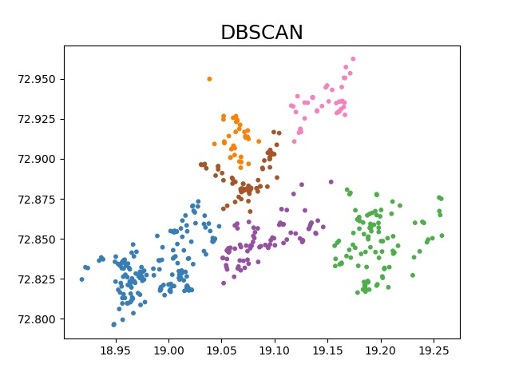
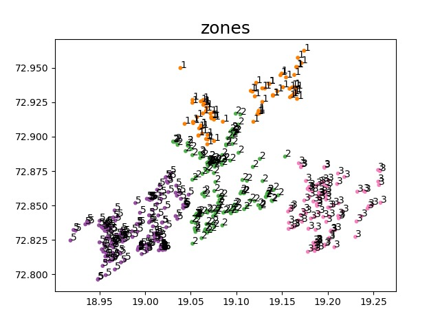

<div align=center>
  <h1>Term Project </h1> 
  <h2>Team Name: Colonel Panic</h2>
  <b>Submitted By:</b>
  <b>Group No. 3</b><br>
  <b>Software Engineering  Project, CSE461 Spring 2020, IIIT Hyderabad </b>
<br><br>
 
</div><br /><br />


# Project Team 
<!-- ALL-CONTRIBUTORS-LIST:START - Do not remove or modify this section -->
| [<br/><sub>Shivang Shekhar](https://github.com/GeekyShiva)<br/>| [<br/><sub>Pratik Mandlecha</sub>](https://github.com/PratikMandlecha)<br/> | [<br/><sub>Rachit Jain</sub>](https://github.com/rachitjain123)<brs/> | [<br/><sub>Raghav Mittal</sub>](https://github.com/raghavmittal101)<br /> | [<br/><sub>Runa Chand</sub>](https://https://github.com/chand987)<br /> | [<br/><sub>Savita Bhat</sub>](https://github.com/savvz)<br />
| :---: | :---: | :---: | :---: | :---: | :---:|
<!-- ALL-CONTRIBUTORS-LIST:END -->

# Documents 

1. [Proposal Document](https://github.com/GeekyShiva/CSE461-SWE-Project/tree/master/Docs/Project_Proposal.pdf)
2. [High-level Design Document](https://github.com/GeekyShiva/CSE461-SWE-Project/tree/master/Docs/HLD_document.pdf)
3. [Slides](https://docs.google.com/presentation/d/17Lka62b90tfmPaar4mK9Xc8UgmDaZoDqnsTilEiwpls/view?usp=sharing)

# Screenshots


# User Interactions


# About Flutter
Flutter is an app SDK for building high-performance, high-fidelity apps for iOS, Android, web (beta), and desktop from a single codebase.

The goal is to enable developers to deliver high-performance apps that feel natural on different platforms. We embrace differences in scrolling behaviors, typography, icons, and more.

# Why Flutter?
Why use Flutter?
What are some advantages of Flutter? It helps you:

* Be highly productive
* Develop for iOS and Android from a single codebase
* Do more with less code, even on a single OS, with a modern, expressive language and a declarative approach
Prototype and iterate easily
* Experiment by changing code and reloading as your app runs (with hot reload)
* Fix crashes and continue debugging from where the app left off
* Create beautiful, highly-customized user experiences
Benefit from a rich set of Material Design and Cupertino (iOS-flavor) widgets built using Flutter’s own framework
* Realize custom, beautiful, brand-driven designs, without the limitations of OEM widget sets

# Flutter Architechture


# Machine Learning

We have implemented clustering of data points which represent the patients infected by corona virus in Mumbai city.
Clustering will generate groups of closed data points. For this we have used DBscan Algorithm.

## About DBScan

It stands for Density based clustering algorithm.It has played a vital role in finding non linear shapes structure based on the density. Density-Based Spatial Clustering of Applications with Noise (DBSCAN) is most widely used density based algorithm. It uses the concept of  density reachability and density connectivity.

* Density Reachability - A point "p" is said to be density reachable from a point "q" if point "p" is within ε distance from point "q" and "q" has sufficient number of points in its neighbors which are within distance ε.
* Density Connectivity - A point "p" and "q" are said to be density connected if there exist a point "r" which has sufficient number of points in its neighbors and both the points "p" and "q" are within the ε distance. This is chaining process. So, if "q" is neighbor of "r", "r" is neighbor of "s", "s" is neighbor of "t" which in turn is neighbor of "p" implies that "q" is neighbor of "p".

## Why DBScan?
* It Does not require a-priori specification of number of clusters.
* It is Able to identify noise data while clustering.
* It is capable of finding arbitrarily size and arbitrarily shaped clusters not like K-means which gives only circular clusters.

## Creating Zones
Once we have the clusters, we are using the number of patients in the cluster and the population pointers (Red, Blue, Orange) in that region of cluster to determine the severity of the zones and have generated 5 zones from it.

## Images of Clusters and Zones
 - Clusters generated by DBScan Algorithm along with latituedes , longitudes.

 - Generated Zones. 


# Dependencies

This project is built with various awesome open sourced libraries

* [google_maps_flutter](https://pub.dev/packages/google_maps_flutter) -  to show map on screen (Still in beta version)
* [flutter_bloc](https://pub.dev/packages/flutter_bloc) - to mantain state and make every widget independent using blocs 
* [bloc](https://pub.dev/packages/bloc) - to listen events on taps by user and dispatch new state to other widgets
* [equatable](https://pub.dev/packages/equatable) - to make models comparable (Nice Library) 
* [shimmer](https://pub.dev/packages/shimmer) - to show nice loading effect
* [location](https://pub.dev/packages/location) - to get current location of user (Feature to be developed)


# Installation

Add your API_KEY and your own credentials from your firebase project to android and ios folders. Run following command in cmd and then run your app

```sh
$ pub get
```


